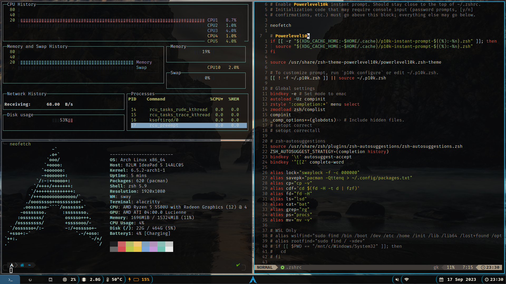

# Arch config

Personal configuration for Arch, including all installed packages and setups.


# Overview Image



# Installation
Follow the steps to do full installation of these configurations

- Clone the repository you don't need the history of it so use depth:
```bash
git clone --depth 1 git@github.com:Mclilzee/arch-fongi.git ~/arch-config
```

- Install packages:
```bash
sudo pacman -S --needed $(< ~/arch-config/packages.txt)
```

- Move home configurations to your home make sure to update .gitconfig to insert your personal information
```bash
mv ~/arch-config/home-configurations/* ~/
```

- Clean up files
```bash
rm -rf ~/arch-config/README.md ~/arch-config/packages.txt ~/arch-config/home-configurations/ ~/arch-config/bin/
```

- Move configurations to your config directory:
```bash
mv ~/arch-config/* ~/.config/
```

- Remove left over directory
```bash
rm -rf ~/arch-config/
```

You should be all set to go!
